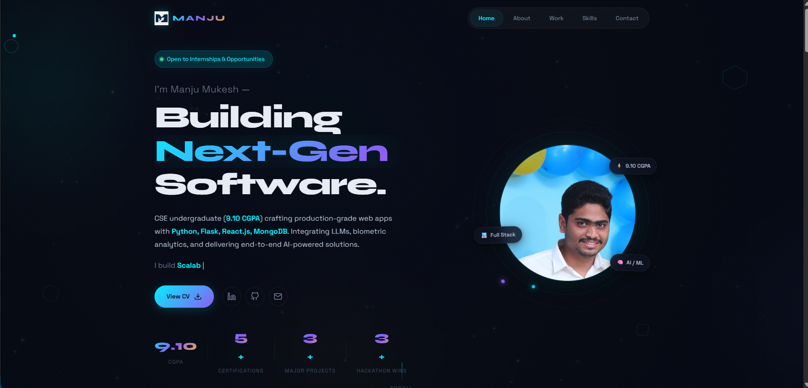

# Manju Mukesh — Developer Portfolio

A highly interactive, corporate-ready personal portfolio website built with pure HTML5, CSS3, and Vanilla JavaScript.



---

## 👤 About

Portfolio website for **Dannina Manju Mukesh** — CSE Undergraduate at Aditya College of Engineering & Technology, Full-Stack Developer, and AI Enthusiast. Built to showcase projects, skills, and experience to recruiters and collaborators.

---

## ✨ Features

- **Custom Page Loader** — Animated ring loader with letter-by-letter name reveal and progress bar
- **Custom Cursor** — Interactive cursor with trail effect
- **Scroll Progress Bar** — Visual reading progress indicator at the top of the page
- **Geometric Canvas Background** — Animated grid drawn on HTML5 Canvas
- **Gradient Mesh Orbs** — Floating ambient background orbs
- **Responsive Navigation** — Active-section indicator with smooth scroll, plus a hamburger mobile menu
- **Hero Section** — Typewriter effect, animated stats counter, floating photo with orbiting elements, and floating tech chips
- **About Section** — Syntax-highlighted Python code block alongside a personal bio
- **Journey Timeline** — Cards for education, projects, and hackathon experiences
- **Projects Section** — Detailed project cards with tech stacks, highlights, and links
- **Skills Section** — Tech pill tags with proficiency levels, CS concepts, certifications, and achievements
- **Scrolling Tech Marquee** — Infinite-loop ticker of technologies
- **Contact Section** — Contact info cards + a functional form powered by Web3Forms
- **Footer & Back-to-Top Button**
- **Grain/Noise Overlay** — Subtle texture over the entire page for depth

---

## 🛠️ Tech Stack

| Layer | Technology |
|---|---|
| Markup | HTML5 |
| Styling | CSS3 (custom properties, glassmorphism, animations) |
| Scripting | Vanilla JavaScript (ES6+) |
| Rendering | HTML5 Canvas API |
| Fonts | Google Fonts — Space Grotesk, Space Mono, Syne |
| Contact Form | [Web3Forms](https://web3forms.com/) |

No frameworks. No build tools. Zero dependencies.

---

## 📁 Project Structure

```
portfolio/
├── index.html                  # Main HTML document
├── style.css                   # All styles and animations
├── script.js                   # All interactivity and JS logic
├── logo.png                    # Nav logo image
├── manju-photo.png             # Hero profile photo
├── project-skillstack.png      # SkillStack AI project screenshot
├── project-portal.png          # Student Affairs Portal screenshot
├── portfolio.png               # Portfolio project screenshot
└── Manju_Mukesh_Resume_ATS.pdf # Downloadable CV
```

---

## 🚀 Getting Started

No installation or build step required.

1. **Clone or download** this repository.
2. Place all assets (`*.png`, `*.pdf`) in the root folder alongside `index.html`.
3. Open `index.html` directly in any modern browser — or serve it locally:

```bash
# Using Python
python -m http.server 8080

# Using Node.js (npx)
npx serve .
```

Then visit `http://localhost:8080`.

---

## 📬 Contact Form Setup

The contact form uses **Web3Forms**. The access key is already embedded in `index.html`. To use your own:

1. Sign up at [web3forms.com](https://web3forms.com/) and get a free access key.
2. In `index.html`, replace the value in:
   ```html
   <input type="hidden" name="access_key" value="YOUR_ACCESS_KEY_HERE">
   ```

---

## 🏆 Featured Projects

### SkillStack AI — Career Launchpad
Full-stack placement prep platform with 11 Flask Blueprint modules, AI mock interviews, MediaPipe FaceMesh biometric analytics, a 5-step RAG pipeline for ATS-optimized resumes, and a 4-tier AI fallback chain (Gemini → OpenAI → OpenRouter → NVIDIA).
**Stack:** Python · Flask · MongoDB Atlas · Gemini AI · Firebase · React.js · MediaPipe · LangChain

### Centralized Student Affairs & Club Portal
Administrative dashboard for the Dean of Student Affairs featuring RBAC, Chart.js analytics, RESTful file-handling APIs, and automated NAAC-compliant PDF/Excel reporting.
**Stack:** Python · Flask · React.js · Tailwind CSS · MongoDB · Chart.js · SheetJS

### Premium Developer Portfolio
This website — interactive particle canvas, custom cursor, glassmorphism UI, 3D tilt effects, and zero dependencies.
**Stack:** HTML5 · CSS3 · Vanilla JS · Canvas API

---

## 📜 License

© 2026 Dannina Manju Mukesh. All rights reserved.

---

## 📞 Contact

- **Email:** 24P31a0585@acet.ac.in
- **Phone:** +91 9490692101
- **LinkedIn:** [linkedin.com/in/manjumukeshdannina](https://www.linkedin.com/in/manjumukeshdannina)
- **GitHub:** [github.com/true-tune-27](https://github.com/true-tune-27)
- **Location:** Surampalem, AP, India 🇮🇳
